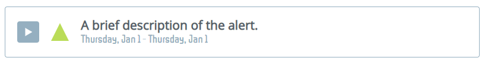
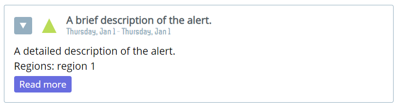
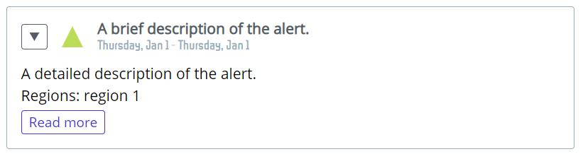
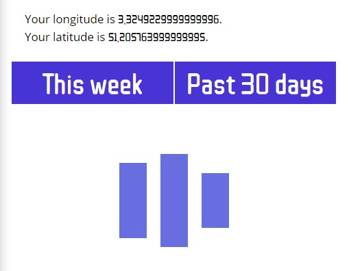
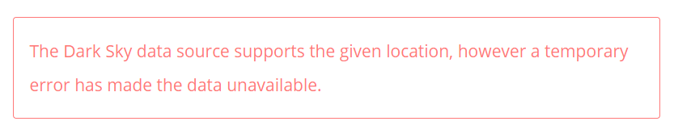
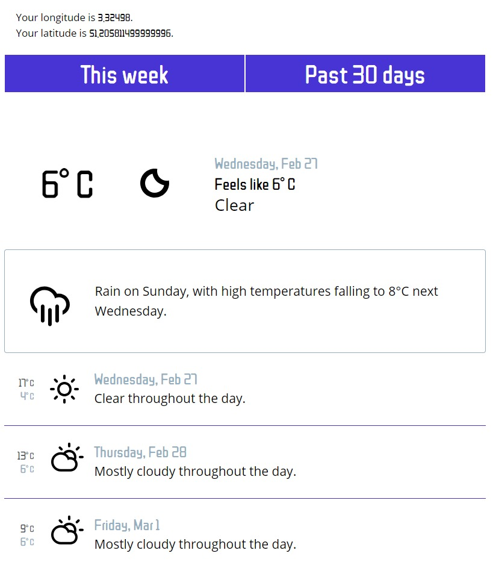
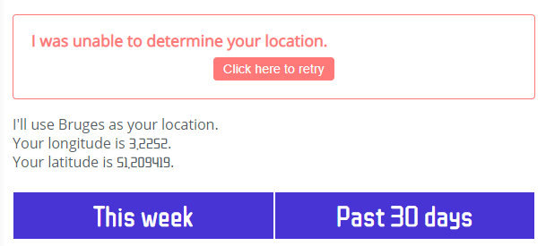

## The application

* [Used packages](#used-packages)
* [Dependencies](#dependencies)
* [DevDependencies](#devdependencies)
* [Icons](#icons)
* [Project architecture](#project-architecture)
* [Available Scripts](#available-scripts)

### Used packages:

#### Dependencies

* `node-sass` - Compile .scss files to css
* `react` - JavaScript library for creating user interfaces.
* `react-dom` - The entry point to the DOM and server renderers for React.
* `react-router-dom` - DOM bindings for React Router.
* `react-scripts` - Scripts and configuration used by Create React App.

##### Redux

I considered using `Redux` but decided against it.

Redux is a predictable state container for JavaScript apps. It is great when an application makes a lot of complex state changes.

This application only makes a few (very simple) state changes, namely in App.js, DarkSkyApiFetcher.js and LocationSelector.js.

[The checkers game I made](https://sdries.github.io/2019/02/08/react-checkers.html) when learning react would greatly benefit from redux, now that I've read more on the subject I will most likely be adding it.

#### DevDependencies

* `enzyme` - JavaScript Testing utility for React
* `enzyme-adapter-react-16` - The adapter corresponding to the version of react
* `enzyme-to-json` - Convert Enzyme wrappers to a format compatible with Jest snapshot testing. (Used when snapshot testing)
* `react-test-renderer` - Render react components as pure JavaScript objects, without depending on the DOM or a native mobile environment. (Used when snapshot testing)

### Icons:
I used the icons provided by [Adam Whitcroft](http://adamwhitcroft.com/climacons/).

### Project architecture

I've split up the code in the `src` directory in several directories: `assets`, `types`, `helpers` and `components`.

#### Assets

The assets directory holds all the assets: images and styles (css/scss).

#### Types

Because I had to redeclare the same propTypes for components in several files it seemed to make sense to group these.

#### Helpers

The helpers directory holds some functionality that is used across various components.

* `darksky-mock.js` - mocks of parts of the expected API results. These mocks are used for testing. They also came in handy when styling components.
* `index.js` - Holds general functions that are used across various components (for example: the way a date should be formatted).

#### Components

The application is made up of several components, most of which deal with displaying the fetched API data.

##### LocationSelector

The LocationSelector component is in charge of fetching a set of coordinates. These coordinates will later be used to fetch the weather data from the backend.

Using the navigator.geolocation object present in the browser the user's location is determined.

If the location cannot be determined (no geolocation object/the user won't allow the use of geolocation/...) I set the center of Bruges as a fallback location.

This component could be expanded (for example using the google maps API) so the user can enter a city's name and the coordinates are found and used within this application.

##### DarkSkyApiFetcher

The `DarkSkyApiFetcher` will call the backend when a set of coordinates is provided.

While loading the data an animated loader will be displayed.

When the data is loaded it will be displayed using the [DarkSky components](#darksky*-components).

##### Error

There Error component is used when an error occurs in the LocationSelector or in the `DarkSkyApiFetcher`.

It displays an error message and, if a method is provided, a button to call a method to try to fix the error.

Should the LocationSelector or the `DarkSkyApiFetcher` be unable to complete their tasks an error message will be displayed. A button saying "Click here to retry" allows the user to retry either finding their location or fetching the data from the `DarkSkyApiFetcher`.

##### App

The App component ties the LocationSelector and `DarkSkyApiFetcher` together.

When the coordinates have been determined, depending on the current route an instance of the `DarkSkyApiFetcher` is rendered.

There are two routes:

* `/` - the home route, displays weather for the upcoming week.
* `/past30days` - the past30days route, displays weather for the past 30 days.

If the route the user is on is not found, a message will be shown: "Sorry, I don't know what you're looking for.".

##### DarkSky* components

The various DarkSky components are based on the API responses found in the Dark Sky API documentation. These components are used to display the response of a successful call to the backend by the `DarkSkyApiFetcher`.

Whenever an icon is displayed the `WeatherIcon` component is used.

### Available Scripts

This project was bootstrapped with [Create React App](https://github.com/facebook/create-react-app).
In the project directory, you can run:

#### `npm start`

Runs the app in the development mode. 
Open [http://localhost:3000](http://localhost:3000) to view it in the browser.

The page will reload if you make edits. 
You will also see any lint errors in the console.

#### `npm test`

Launches the test runner in the interactive watch mode. 
See the section about [running tests](https://facebook.github.io/create-react-app/docs/running-tests) for more information.

#### `npm run build`

Builds the app for production to the `build` folder. 
It correctly bundles React in production mode and optimizes the build for the best performance.

The build is minified and the filenames include the hashes. 
Your app is ready to be deployed!

See the section about [deployment](https://facebook.github.io/create-react-app/docs/deployment) for more information.

#### `npm run eject`

**Note: this is a one-way operation. Once you `eject`, you can’t go back!**

If you aren’t satisfied with the build tool and configuration choices, you can `eject` at any time. This command will remove the single build dependency from your project.

Instead, it will copy all the configuration files and the transitive dependencies (Webpack, Babel, ESLint, etc) right into your project so you have full control over them. All of the commands except `eject` will still work, but they will point to the copied scripts so you can tweak them. At this point you’re on your own.

You don’t have to ever use `eject`. The curated feature set is suitable for small and middle deployments, and you shouldn’t feel obligated to use this feature. However we understand that this tool wouldn’t be useful if you couldn’t customize it when you are ready for it.

### Learn More

You can learn more in the [Create React App documentation](https://facebook.github.io/create-react-app/docs/getting-started).

To learn React, check out the [React documentation](https://reactjs.org/).

#### Code Splitting

This section has moved here: https://facebook.github.io/create-react-app/docs/code-splitting

#### Analyzing the Bundle Size

This section has moved here: https://facebook.github.io/create-react-app/docs/analyzing-the-bundle-size

#### Making a Progressive Web App

This section has moved here: https://facebook.github.io/create-react-app/docs/making-a-progressive-web-app

#### Advanced Configuration

This section has moved here: https://facebook.github.io/create-react-app/docs/advanced-configuration

#### Deployment

This section has moved here: https://facebook.github.io/create-react-app/docs/deployment

#### `npm run build` fails to minify

This section has moved here: https://facebook.github.io/create-react-app/docs/troubleshooting#npm-run-build-fails-to-minify
